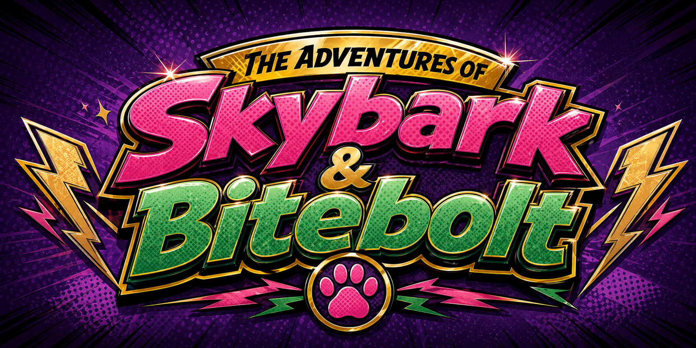
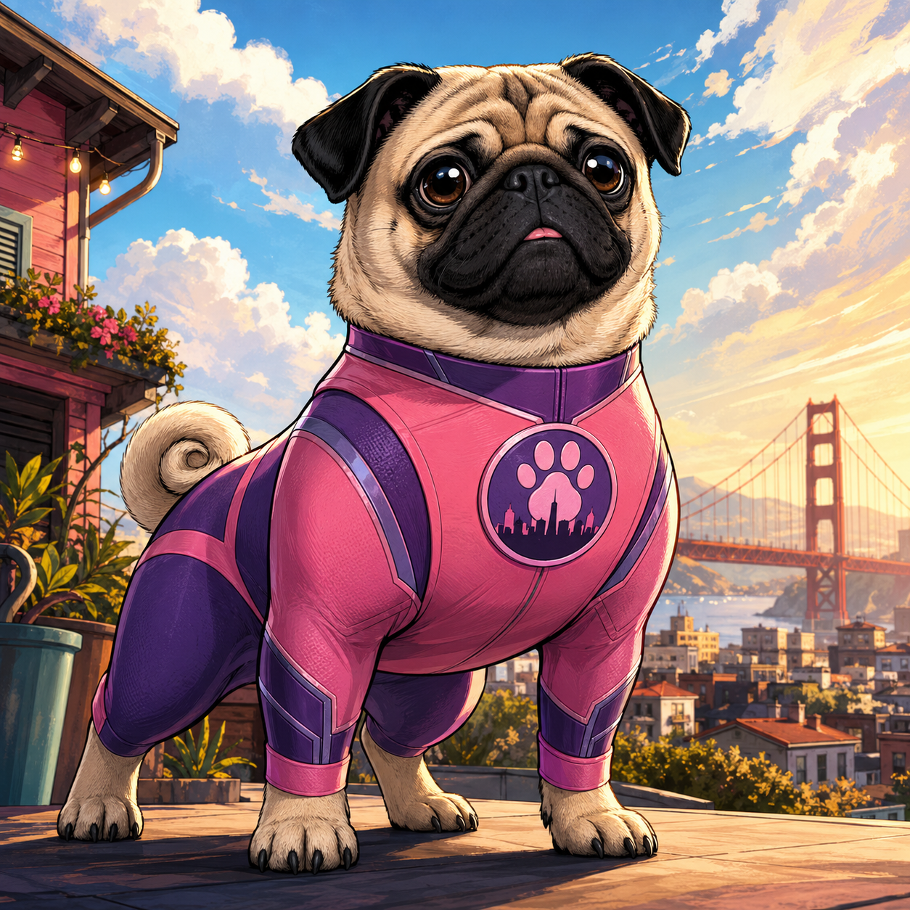
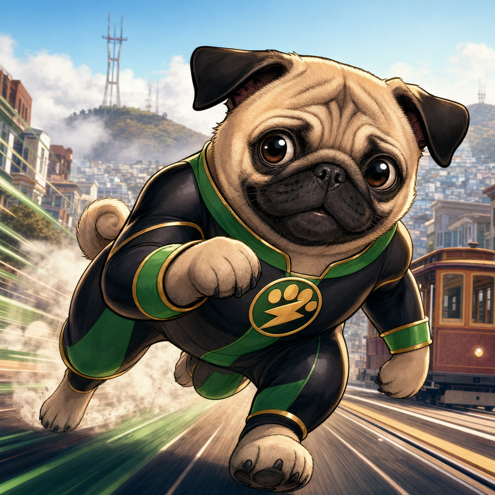
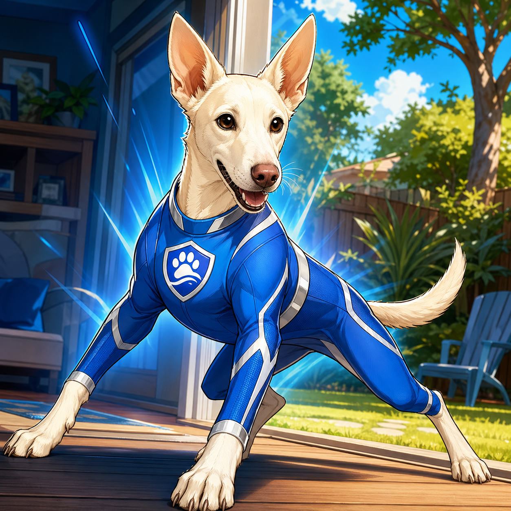
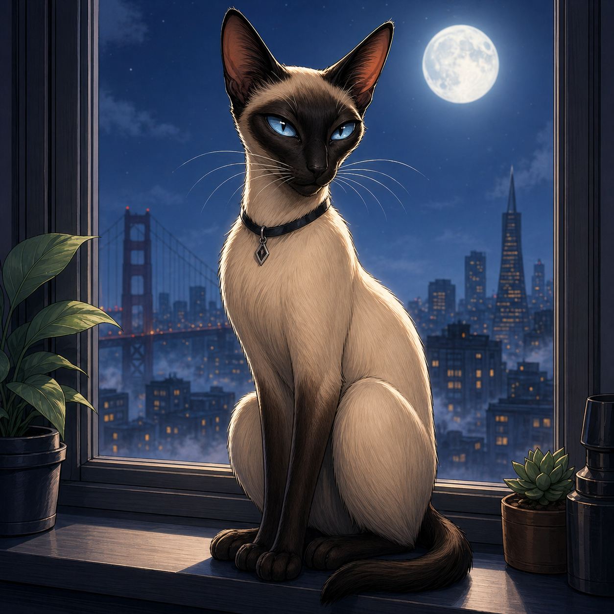
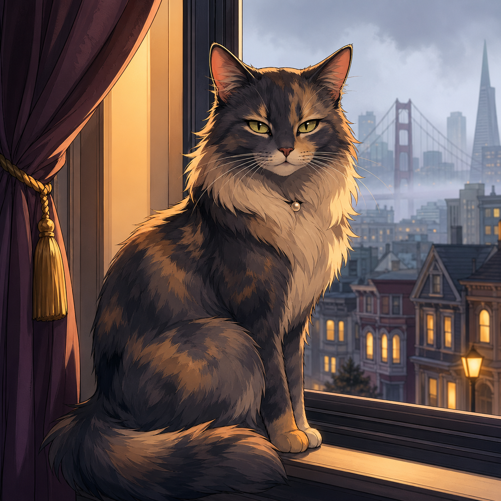
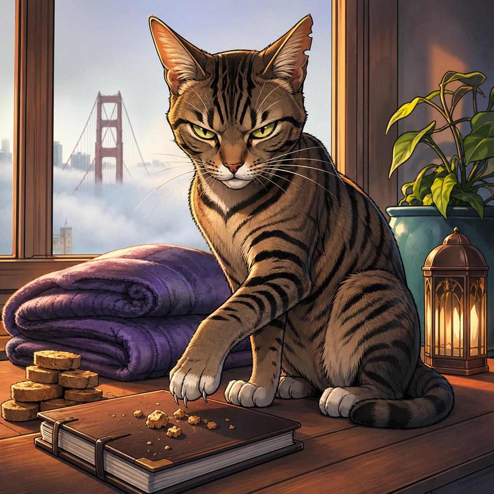
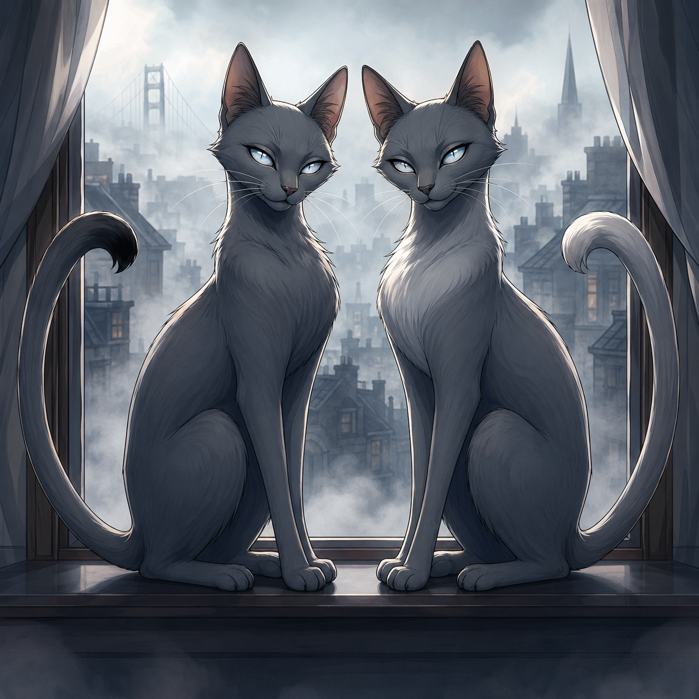
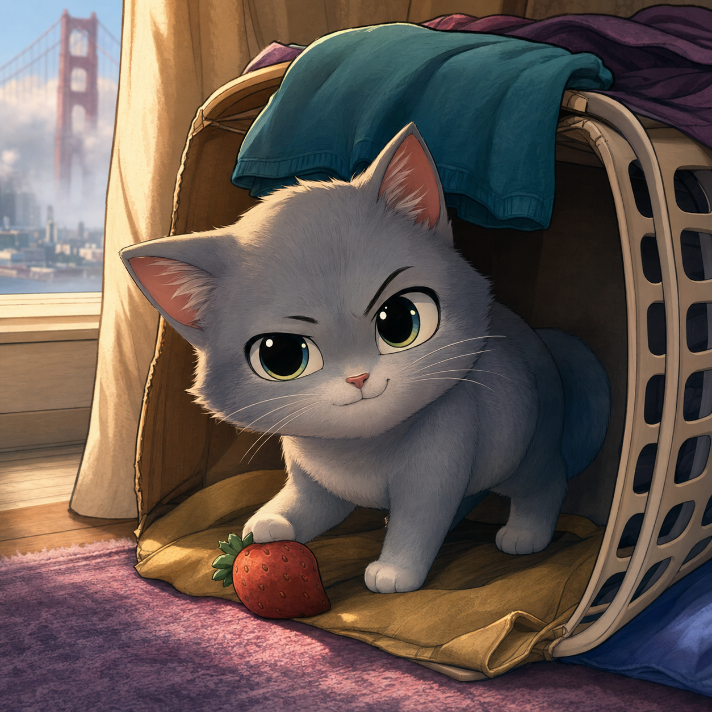

  

Tiny heroes. Big barks. Suspiciously coordinated cats.

**Skybark** is an all-ages comic-book series about Pacey and Joey, two San Francisco puggies whose ordinary days keep tilting into superhero-sized trouble. A missing sunbeam may be a household mystery, a citywide conspiracy, or the opening move in a villain plot. A bath may be a bath, or it may be a flood emergency. The fun lives in that double vision: the rescues feel heroic, the comedy stays cozy, and the reader never gets the whole thing pinned down too neatly.

The comics follow Skybark, Bitebolt, and their cousin Captain Blueguard as they defend snacks, blankets, family spaces, beach days, bookstores, rooftops, and the sacred right to nap in the best sun patch. Their enemies are the Whisperclaw Cabal, a secretive network of cats who may be criminal masterminds, ordinary neighborhood cats, or exactly both depending on which panel you believe.

## Heroes

| Character | Field Notes |
| --- | --- |
|  <strong>Skybark</strong> Pacey | The Sentinel of the Roofline. Skybark is a compact pink-and-purple guardian with a bark loud enough to challenge airplanes, suspicious noises, and any threat to home turf. She is stubborn, noble, clever, and absolutely unwilling to back down. |
|  <strong>Bitebolt</strong> Joey | The Golden Blur. Bitebolt is fast, food-motivated, underestimated, and very often halfway to solving the problem before he understands the mission. His power is speed, snack radar, and accidental genius at exactly the wrong time for villains. |
|  <strong>Captain Blueguard</strong> Sailor | The Roughhouse Shield. Captain Blueguard brings big cousin energy from Palo Alto: loyal, blue-clad, bouncy, and ready to turn protection into heroic horseplay. If family needs backup, he launches first and asks questions while wagging. |

## Villains

### The Whisperclaw Cabal

The Cabal moves through San Francisco like fog with whiskers: windowsills, rooftops, delivery boxes, curtain shadows, snack routes, and any soft blanket left unguarded. Their schemes look tiny to humans, but Skybark knows the truth. Comfort is power.

| Character | Cabal File |
| --- | --- |
|  <strong>Mr. W</strong> | The calm, elegant mastermind behind the Cabal. Mr. W never rushes, rarely explains, and treats every defeat as a temporary atmospheric complication. |
|  <strong>Madame Mew</strong> | The intelligence chief. She appears where secrets are about to happen, watches from windows, and gathers information without ever seeming to move. |
|  <strong>Scratch Ledger</strong> | The planner and accountant. Scratch Ledger tracks crumbs, treats, and blanket ownership with frightening precision, especially when Joey eats the evidence. |
|  <strong>Karl and Karla</strong> The Fog Twins | Nearly identical gray agents who appear whenever San Francisco fog rolls in. They may be cats, reflections, silhouettes, or a perfectly synchronized problem. |
|  <strong>Button</strong> | The smallest agent and one of the most dangerous because everyone assumes Button is harmless. Button can fit into vents, boxes, bags, and all the tiny places where trouble starts. |

## Episodes

- [Episode 01: The Missing Sunbeam](reader.html?episode=episode-01)
- [Episode 02: The Great Flood](reader.html?episode=episode-02)
- [Episode 03: The Palo Alto Squiral Siege](reader.html?episode=episode-03)
- [Episode 04: The Calgary Cup Caper](reader.html?episode=episode-04)
- [Episode 05: The Sutro Surfkite Rescue](reader.html?episode=episode-05)
- [Episode 06: The Sonoma Cheese Flight](reader.html?episode=episode-06)
- [Episode 07: The Citywide Toy Rescue](reader.html?episode=episode-07)
- [Episode 08: The North Beach Bookshop Heist](reader.html?episode=episode-08)
- [Episode 09: The Colma Brain Drain](reader.html?episode=episode-09)
- [Episode 10: The Alcatraz Zoomie Breakout](reader.html?episode=episode-10)
- [Episode 11: The Penguin Heat Heist](reader.html?episode=episode-11)
- [Episode 12: The Golden Gate Picnic Pinch](reader.html?episode=episode-12)

## Repository Notes

`reader.html` is the shared comic reader. Episode metadata, including title, episode number, name, season, cover paths, and page lists live in `episodes/catalog.js`; each episode folder only needs its `images/` directory.
